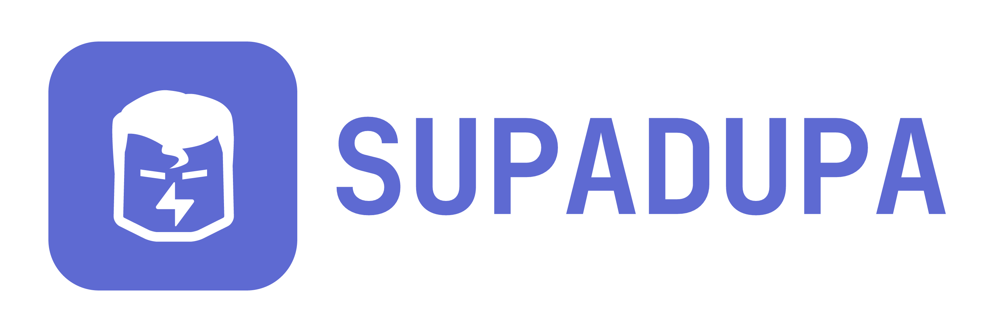

<p align="center">
  
</p>

<p align="center">
  <strong>The self-hosted Supabase control plane for teams that need isolated projects, enterprise operations, and full infrastructure ownership.</strong>
</p>

<p align="center">
  <a href="#why-supadupa">Why Supadupa</a> ·
  <a href="#platform-capabilities">Capabilities</a> ·
  <a href="#security-and-governance">Security</a> ·
  <a href="#quickstart">Quickstart</a> ·
  <a href="https://billiondollarsolo.github.io/supadupa-docs/">Docs</a>
</p>

---

Supadupa turns your own Linux host or VPS into a multi-project Supabase platform. It provisions and operates isolated Supabase-style stacks, exposes each project through managed routes and TLS, and gives operators a single control plane for projects, users, access, backups, upgrades, telemetry, security posture, and automation.

Instead of hand-maintaining separate Supabase Compose installs, Supadupa provides the platform layer around them: an Admin UI, Management API, CLI, Terraform/OpenTofu provider, MCP server, compatibility harness, provisioning engine, routing fabric, backup controls, release catalog, and operational guardrails.

Current release: `0.2.0`. The supported runtime path is Docker Compose. Kubernetes artifacts exist as a Helm/operator scaffold, but Docker Compose is the primary evaluated path today.

## Why Supadupa

Modern teams want the Supabase developer experience without giving up control of infrastructure, network boundaries, backup policy, data placement, or operational evidence. Supadupa is built for that operating model.

Use Supadupa when you need to:

- Run many Supabase-style projects on infrastructure you own.
- Keep each project isolated by runtime directory, Docker network, secrets, route manifest, and database.
- Offer developers familiar Supabase surfaces: Auth, REST, GraphQL, Storage, Realtime, Edge Functions, Studio, Postgres, and pooler endpoints.
- Centralize operations in one admin console and API.
- Control DNS, TLS, database exposure, backup posture, upgrades, and access policy.
- Validate compatibility and security boundaries with repeatable test harnesses.
- Build toward enterprise platform requirements without outsourcing project data-plane ownership.

## What Supadupa Delivers

| Area | What you get |
| --- | --- |
| Project platform | Multi-project Supabase-style runtime provisioning with isolated Compose stacks. |
| Admin experience | Browser Admin UI for organizations, users, projects, settings, routes, backups, logs, metrics, security, audit, and operations. |
| Developer surfaces | Project API, Studio, Auth, REST, GraphQL, Storage, S3-compatible Storage, Realtime, Functions, Postgres, and Supavisor pooler endpoints. |
| Enterprise operations | Fleet metrics, project telemetry, stack release catalog, guarded upgrades, recoverability reporting, Advisor, Compliance, audit trails, and runtime health. |
| Security posture | Default-private project containers, Traefik-only ingress, secret handles, encrypted persistent secrets, MFA seed encryption, cookie-based admin auth, RBAC, audit events, and Docker socket proxy hardening. |
| Automation | Management API, Supadupa CLI, Terraform/OpenTofu provider, MCP server, and compatibility scripts. |
| Recovery controls | Logical backups, control-plane backups, backup target management, physical backup plumbing, WAL/PITR plumbing, and durable-upgrade backup gates. |
| Edge routing | Traefik dynamic routing, Cloudflare DNS-01 certificates, wildcard project domains, custom domains, and BYO certificate upload. |

## Platform Capabilities

### Multi-Project Supabase Runtime

Supadupa provisions a complete project runtime for each project ref. A `full` profile project includes the major Supabase data-plane services and is rendered as its own Compose stack under `runtime/projects/<ref>`.

Generated project surfaces typically include:

```text
https://<ref>.apps.example.com                 Project API gateway
https://studio-<ref>.apps.example.com          Supabase Studio
https://storage-<ref>.apps.example.com         Storage/S3 edge
db-<ref>.apps.example.com:5432                 Direct Postgres, optional public exposure
pooler-<ref>.apps.example.com:6543             Transaction/session pooler, optional public exposure
```

Project creation is asynchronous and observable. The control plane moves projects through lifecycle states such as `provisioning`, `starting`, `healthy`, and `degraded`, and the UI/API expose runtime status and recent activity.

### Admin Console

The Supadupa Admin UI is the operator workspace for the platform:

- Organizations, members, users, teams, and project access.
- Project creation, scaling, pause/resume/restart, destroy, and retained-volume workflows.
- Project Connect page with URLs, keys, database strings, pooler strings, and CLI profiles.
- Runtime health, logs, metrics, route status, activity, and telemetry.
- Platform defaults for domain, stack version, profile, resource tier, backup schedule, and feature flags.
- Backup targets, backup policies, control-plane backups, project backups, and recoverability status.
- Security, Advisor, Compliance, audit events, and operational evidence screens.
- Settings for SSO/SCIM-compatible surfaces and platform policy controls.

### Supabase Compatibility

Supadupa is designed to preserve the developer contract that Supabase users expect:

- Supabase JS client flows.
- Auth signup, password grant, admin user APIs, and user session APIs.
- PostgREST and GraphQL surfaces.
- Storage bucket/object APIs and signed URLs.
- S3-compatible Storage operations.
- Realtime websocket subscriptions and broadcast.
- Edge Function deployment and invocation.
- Supabase Studio access per project.
- Official Supabase CLI database workflows where supported.
- Supadupa tunnel/wrapper fallback for CLI type generation when public DB TLS tooling hits upstream constraints.

The compatibility harness in [scripts/compat](scripts/compat) validates these surfaces against live projects.

### Routing, DNS, And TLS

Supadupa separates the control plane from project apps:

```text
admin.example.com       Admin UI
api.example.com         Management API
*.apps.example.com      Generated project routes
```

Traefik owns public ingress. Project containers are not host-published directly. In the default VPS posture, only `80` and `443` are public. Direct database and pooler ports stay loopback-bound unless the operator explicitly enables public database access.

TLS is automated through Cloudflare DNS-01. Supadupa supports wildcard certificate scopes for the control plane and project apps, generated project routes, custom domain metadata, route/certificate artifacts, and BYO certificate upload.

### Lifecycle And Upgrades

Supadupa includes a stable stack release catalog and guarded project upgrade workflow:

- Stable stack versions are exposed through `GET /v1/stack-releases`.
- Project upgrades create or verify pre-upgrade logical backup metadata.
- Upgrade actions record rollback metadata and audit events.
- Durable upgrade backup enforcement can require off-host recovery posture before risky changes.
- Control-plane updates use normal Compose rebuild/restart and expose version/build metadata through `/v1/health` and the About page.

### Backups And Recovery

Supadupa gives operators the primitives needed to build a real recovery posture:

- Project logical backups.
- Control-plane backups.
- S3-compatible backup target management and target tests.
- Physical backup plumbing.
- WAL archive/PITR plumbing.
- Recoverability reports.
- Backup policy management.
- Advisor and Compliance findings when recovery gates are not production-ready.

For production-like use, configure a real off-host S3/R2/remote-MinIO target, enable recovery-ready gates, and validate destructive restore flows against disposable projects.

### Automation And Integrations

Supadupa is not only a UI. It is an automation surface:

- Management API for platform and project operations.
- Supadupa CLI for login, project creation, connect profiles, DB tunnels, type generation, backup/recovery, config, secrets, functions, metrics, and lifecycle actions.
- Terraform/OpenTofu provider scaffold for infrastructure-as-code workflows.
- MCP server for tool-driven platform operations.
- Compatibility test suite for repeatable live validation.
- Scripted local and VPS setup paths.

## Security And Governance

Supadupa is built around a default-closed operating model.

### Isolation

Under the Compose provisioner, each project receives dedicated runtime state and networks. The shared edge router joins project edge networks only for route delivery. Project services are not directly host-published; public access flows through Traefik.

### Secret Handling

Supadupa stores and exposes project secrets through scoped handles where possible. Persistent control-plane secrets are encrypted with stable platform secret material or optional external key mechanisms. Runtime `.env` files, generated project directories, local certificates, compatibility artifacts, and backup artifacts are treated as sensitive local state and ignored by git.

### Access Control

The platform includes:

- Platform users and admin authentication.
- HttpOnly browser session cookies.
- MFA seed encryption.
- Token-version checks for stale platform admin tokens.
- Organization membership and project access grants.
- Team/project RBAC surfaces.
- Studio access mediated by Supadupa control-plane login and short-lived Studio session codes.
- Audit events for privileged and destructive actions.

### Network Exposure

Default public exposure is intentionally narrow:

```text
80/tcp    HTTP redirect / ACME
443/tcp   HTTPS edge
```

Database-facing edge ports `5432` and `6543` bind to `127.0.0.1` by default. To expose raw Postgres/pooler access externally, operators must intentionally bind public ports, enable the platform database external access switch, set per-project database ingress mode, and restrict traffic with host/provider firewalls and CIDR allowlists.

### Docker Boundary

The control plane does not mount the Docker socket directly. Compose apply mode uses an isolated Docker socket proxy with allowlisted operations and request filtering. Treat the proxy as a sensitive host-administrative boundary; for stricter production isolation, run apply workers on a separate host or VM.

## Architecture

At a high level, Supadupa is composed of:

```text
Admin UI                  Browser control surface
Management API            Auth, project, settings, backups, metrics, audit, and automation API
Meta database             Persistent platform state
Provisioner/Reconciler    Renders and applies project runtimes
Traefik edge router       Public ingress, TLS, route fanout
Docker socket proxy       Constrained Compose lifecycle boundary
Project runtimes          Isolated Supabase-style stacks
Compatibility harness     Live validation for Supabase-compatible behavior
```

Default runtime state lives under:

```text
runtime/projects     rendered per-project Compose stacks
runtime/routes       Traefik dynamic route manifests
runtime/certs        uploaded/generated certificate artifacts
runtime/backups      project and platform backup artifacts
```

Do not delete `runtime/` unless you intentionally want to remove rendered state and local artifacts.

## Quickstart

### Requirements

For local evaluation:

- Docker and Docker Compose v2.
- Linux or macOS.

For VPS/public TLS:

- Linux VPS with a public IPv4 or IPv6 address.
- Docker and Docker Compose v2.
- DNS control for your domain.
- Cloudflare DNS API token for Let's Encrypt DNS-01.
- Inbound `80` and `443`.
- Inbound `5432` and `6543` only when intentionally exposing public database/pooler routes.

For native development:

- Go `1.25+`.
- Node `^20.19.0` or `>=22.12.0`.

Resource planning: budget roughly **4 GB RAM per `full` profile project** plus about **0.5 GB** for the control plane. Use leaner profiles or disable analytics on smaller hosts.

### Get The Code

```bash
git clone https://github.com/billiondollarsolo/supadupa.git
cd supadupa
```

### Local Loopback

Use this path for the fastest evaluation loop. It starts the control plane, meta database, and Admin UI on local ports.

```bash
export SUPADUPA_BOOTSTRAP_PASSWORD='change-this-password'
scripts/setup-compose.sh --mode local
docker compose --env-file .env -f deploy/compose.yaml -f deploy/compose.apply.yaml up -d --build
```

Open:

```text
http://localhost:3000
```

The default bootstrap email is `admin@example.test` unless you pass `--bootstrap-email`.

### VPS With DNS And TLS

Use this path for public Admin/API routes and wildcard project TLS.

```bash
export CLOUDFLARE_API_TOKEN='...'
export SUPADUPA_BOOTSTRAP_PASSWORD='change-this-password'

scripts/setup-compose.sh \
  --mode vps \
  --domain example.com \
  --email ops@example.com \
  --bootstrap-email admin@example.com
```

Create DNS records pointing at the VPS:

```text
admin.example.com       A/AAAA  <server-ip>
api.example.com         A/AAAA  <server-ip>
*.apps.example.com      A/AAAA  <server-ip>
```

Start the public edge stack:

```bash
docker compose --env-file .env -f deploy/compose.yaml -f deploy/compose.apply.yaml --profile edge up -d --build
```

Open:

```text
https://admin.example.com
```

Postgres and pooler edge ports bind to `127.0.0.1` by default. Pass `--db-public-bind` only when external raw database clients are required, then also configure platform and per-project database ingress plus firewall rules.

## First Operator Workflow

After logging in:

1. Open `Settings -> Defaults`.
2. Confirm the project domain, default stack version, profile, tier, and backup schedule.
3. Open `Settings -> Backups`.
4. Add and test an off-host backup target for production-like validation.
5. Create an organization.
6. Create a project.
7. Wait for the project to become `healthy`.
8. Open `Connect` for API keys, database URLs, pooler URLs, and CLI profile.
9. Open project Studio.
10. Review Advisor, Compliance, logs, metrics, and audit events.

## CLI Example

```bash
go run ./cmd/supadupa-cli --api https://api.example.com login \
  --email admin@example.com \
  --password 'change-this-password'

go run ./cmd/supadupa-cli --api https://api.example.com projects create \
  --org-id <org-id> \
  --ref smoke \
  --name "Smoke"

go run ./cmd/supadupa-cli --api https://api.example.com projects cli-profile \
  --ref smoke \
  --format env
```

## Operating Supadupa

Common commands:

```bash
docker compose --env-file .env -f deploy/compose.yaml -f deploy/compose.apply.yaml ps
docker compose --env-file .env -f deploy/compose.yaml -f deploy/compose.apply.yaml logs -f supadupavisor
docker compose --env-file .env -f deploy/compose.yaml -f deploy/compose.apply.yaml --profile edge logs -f edge-router
```

Stamp a control-plane rebuild with the current commit:

```bash
git pull
SUPADUPA_BUILD_SHA="$(git rev-parse --short HEAD)" \
  docker compose --env-file .env -f deploy/compose.yaml -f deploy/compose.apply.yaml --profile edge up -d --build
```

Run local validation:

```bash
go test ./...
npm --prefix frontend run build
bash -n scripts/compat/*.sh
```

Run a live compatibility profile:

```bash
export SUPADUPA_API_URL=https://api.example.com
export SUPADUPA_TEST_EMAIL=admin@example.com
export SUPADUPA_TEST_PASSWORD='change-this-password'
export SUPADUPA_TEST_REF=smoke
scripts/compat/run.sh
```

## Release Status

Supadupa is early software. The `0.2.x` line is appropriate for evaluation, internal development, and production-like validation by operators who understand the remaining gaps. It is not yet a hosted-grade v1 platform.

Known limitations:

- Destructive PITR restore still needs full proof against real off-host S3/R2/remote-MinIO targets in live production-like deployments.
- Failed-upgrade restore needs durable off-host artifact validation beyond local/dev artifacts.
- Official `supabase gen types --db-url` against public DB routes can hit upstream Supabase CLI TLS/CA constraints; Supadupa provides a tunnel/wrapper fallback.
- Real third-party provider behavior still needs broader proof for external CDN propagation, SMS delivery, and true multi-region placement/failover.
- Kubernetes is not the primary supported runtime path yet.
- Compliance screens are operator evidence helpers, not certification claims.

See [Known Issues & Operational Notes](docs/known-issues.md) before treating an install as production-like.

## Documentation

- User docs: [https://billiondollarsolo.github.io/supadupa-docs/](https://billiondollarsolo.github.io/supadupa-docs/)
- Install guide: [docs/install.md](docs/install.md)
- DNS and TLS: [docs/dns-tls.md](docs/dns-tls.md)
- Projects: [docs/projects.md](docs/projects.md)
- Backups and recovery: [docs/backups-recovery.md](docs/backups-recovery.md)
- Security: [docs/security.md](docs/security.md)
- Compatibility suite: [scripts/compat/README.md](scripts/compat/README.md)

## Repository Layout

```text
cmd/supadupa                 control-plane binary
cmd/supadupa-cli             CLI client
cmd/supadupa-mcp             MCP server
cmd/terraform-provider-*     Terraform/OpenTofu provider
frontend                     admin UI
internal/api                 Management API
internal/control             domain services and store contracts
internal/provisioner/compose Docker Compose project renderer/applier
internal/provisioner/kubernetes Kubernetes renderer
deploy                       Dockerfiles and Compose stack
migrations                   control-plane meta DB migrations
scripts/compat               compatibility suite
docs                         product, validation, and archived docs
```
